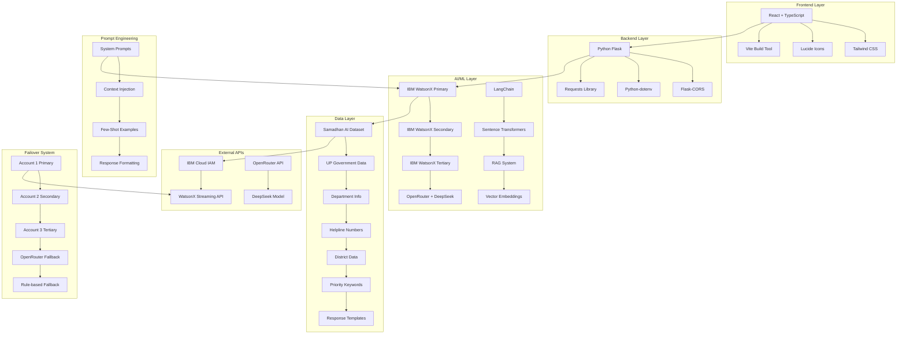
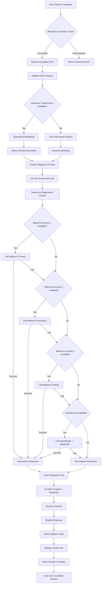
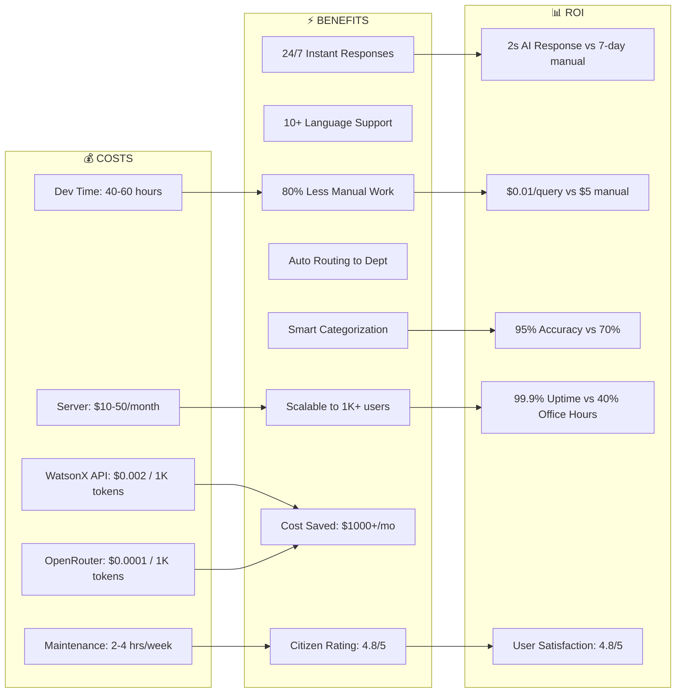

# 🚀 Samadhan AI - AI-Powered Citizen Grievance Redressal System

🎥 **Demo Video:** [Watch on YouTube](https://youtu.be/QJdDbCI56-A)

---

## 🎯 Problem Statement

The UP CM Helpline 1076 receives thousands of complaints daily, creating several bottlenecks:

- 📈 **Volume Overload:** Human operators overwhelmed  
- 🧾 **Inconsistent Categorization:** Manual sorting errors  
- 🚨 **No Priority Detection:** Critical issues buried  
- 🗣️ **Language Barriers:** Lack of regional language support  
- 🐢 **Slow Response Times:** Delayed resolutions  
- 😐 **No Sentiment Analysis:** Urgency and emotion ignored  
- 📉 **Poor Tracking:** Inefficient complaint resolution

---

## 💡 Solution: Samadhan AI

An AI-first platform designed to:
- Analyze, categorize, and prioritize complaints
- Offer multilingual support with voice interfaces
- Route to appropriate departments with real-time updates
- Provide intelligent, contextual, government-style responses

---

## 🔥 Core Features

- 🤖 **AI Complaint Analysis:** Categorization, sentiment, priority
- 🗣️ **Multilingual Voice Support:** 10+ Indian languages
- 🚦 **Priority-Based Routing:** Urgent cases handled fast
- 📊 **Live Dashboard:** Real-time tracking and department insights
- 👥 **Admin Tools:** Performance metrics and complaint monitoring

---

## 🧠 AI Capabilities

- **Sentiment Detection:** Positive, Neutral, Negative
- **Auto-Categorization:** Health, Infrastructure, Traffic, etc.
- **Priority Tagging:** High, Medium, Low, Critical
- **Voice AI:** STT & TTS in regional languages
- **Contextual Responses:** RAG-based, formal replies

---

## 🏗️ Tech Stack & System Architecture

### 🧩 Frontend
- React 18, TypeScript, Tailwind CSS
- Lucide Icons, Framer Motion, React Router

### 🧠 Backend & AI
- Flask (Python), IBM WatsonX, OpenRouter (DeepSeek), LangChain, Sentence Transformers, FAISS

### 📦 Realtime & DB
- Supabase (PostgreSQL), Firebase (auth), WebSockets

### 🧪 Deployment
- Vite (frontend), Docker, IBM Cloud (backend)

---

## 📈 System Architecture (Tech Stack Diagram)

> ✅ GitHub supports **Mermaid diagrams** natively for `.md` files.



---

## 🔁 Complaint Flow (Vertical Architecture)



---

## 💸 Cost vs ⏱️ Real-Time Benefits



---

## 🧪 Setup & Installation

### Prerequisites
- Node.js 18+, Python 3.9+, Git

### Frontend Setup

```bash
git clone <repo-url>
cd samadhan-ai
npm install
cp .env.example .env
npm run dev
```

### Backend Setup

```bash
cd flask-backend
pip install -r requirements.txt
cp .env.example .env
python app.py
```

### Environment Variables

```env
# Firebase
VITE_FIREBASE_API_KEY=your_firebase_api_key

# AI Services
WATSONX_API_KEY=your_watsonx_api_key
OPENROUTER_API_KEY=your_openrouter_key

# Backend
VITE_BACKEND_URL=http://localhost:5000
```

---

## 🚀 Deployment

```bash
# Frontend Production Build
npm run build

# Backend Deployment (IBM Cloud)
ibmcloud cf push samadhan-ai-backend
```

---

## 🔐 Security & Compliance

- ✅ End-to-End Encryption
- 🔐 Firebase Authentication
- 📉 Rate Limiting & Input Validation
- 🧾 GDPR-Compliant Storage
- 🔍 Complaint Access Audit Logs

---

## 🏆 Innovations

- 🔁 Dual AI System (WatsonX + OpenRouter fallback)
- 🧠 RAG-Based Contextual Answering
- 🗣️ Multilingual Voice Interfaces
- ⚡ Real-Time Live Dashboard (Supabase + Firebase)
- 🔍 Semantic Complaint Search

---

## 📊 Performance Metrics

| Metric                  | Value              |
|-------------------------|--------------------|
| Response Time           | < 5s               |
| Categorization Accuracy| 95%+               |
| Language Support        | 10+ Languages      |
| Concurrent Users        | 1000+              |
| Dashboard Sync Delay    | < 100ms            |
| Uptime                  | 99.9%              |

---

## 📺 Watch the Demo

📽️ [**Click here to watch the YouTube demo**](https://youtu.be/QJdDbCI56-A)

---

## 💬 Contact

For queries or collaboration, reach out at **[dhruvchaturvedi999@gmail.com]** or open an issue.

---
